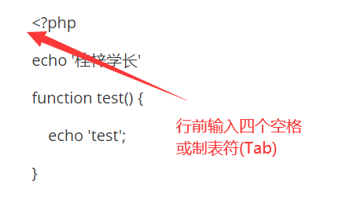

<!--
 * @Author: your name
 * @Date: 2021-04-01 15:03:31
 * @LastEditTime: 2021-04-01 15:27:49
 * @LastEditors: Please set LastEditors
 * @Description: In User Settings Edit
 * @FilePath: \blog\blog\docs\markdown\markdown代码.md
-->

## Markdown 代码

如果是段落上的一个函数或片段的代码可以用反引号把它包起来（`），例如：

    `printf()` 函数

显示结果如下：

`printf()` 函数

### 代码区块

代码区块使用 4 个空格或者一个制表符（Tab 键）。

实例如下：



显示结果如下：

    <?php
    ​echo '桂梓学长'
    ​function test() {
    ​	echo 'test';
    ​}

<br>

你也可以用 ``` 包裹一段代码，并指定一种语言（也可以不指定）：

    ```javascript
    $(document).ready(function () {
        alert('RUNOOB');
    });
    ```

显示结果如下：

```javascript
$(document).ready(function () {
    alert('RUNOOB');
});
```