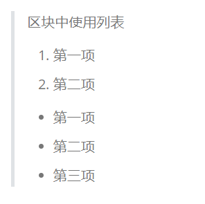
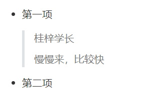

<!--
 * @Author: your name
 * @Date: 2021-04-01 14:38:57
 * @LastEditTime: 2021-04-01 15:03:05
 * @LastEditors: Please set LastEditors
 * @Description: In User Settings Edit
 * @FilePath: \blog\blog\docs\markdown\markdown区块.md
-->

## Markdown 区块

Markdown 区块引用是在段落开头使用`>`符号 ，然后后面紧跟一个空格符号：

    > 区块引用
    > 桂梓学长
    > 慢慢来，比较快

显示结果如下：

另外区块是可以嵌套的，一个`>`符号是最外层，两个`>`符号是第一层嵌套，以此类推：

    > 最外层
    > > 第一层嵌套
    > > > 第二层嵌套

显示结果如下：

### 区块中使用列表

区块中使用列表实例如下：

    > 区块中使用列表
    > 1. 第一项
    > 2. 第二项
    > + 第一项
    > + 第二项
    > + 第三项

显示结果如下：

### 列表中使用区块

如果要在列表项目内放进区块，那么就需要在`>`前添加四个空格的缩进。

列表中使用区块实例如下：

    * 第一项
        > 桂梓学长
        > 慢慢来，比较快
    * 第二项

显示结果如下：

