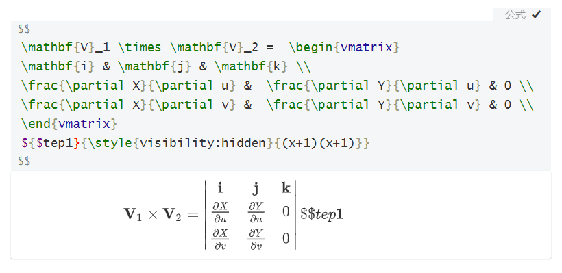

<!--
 * @Author: your name
 * @Date: 2021-04-01 16:09:16
 * @LastEditTime: 2021-04-01 16:35:17
 * @LastEditors: Please set LastEditors
 * @Description: In User Settings Edit
 * @FilePath: \blog\blog\docs\markdown\markdown高级技巧.md
-->

## Markdown 高级技巧

### 支持的 HTML 元素

不在 Markdown 涵盖范围之内的标签，都可以直接在文档里面用 HTML 撰写。

目前支持的 HTML 元素有：`<kbd>` `<b>` `<i>` `<em>` `` `` ` `等 ，如：

    使用 <kbd>Ctrl</kbd>+<kbd>Alt</kbd>+<kbd>Del</kbd> 重启电脑

输出结果为：

使用 <kbd>Ctrl</kbd>+<kbd>Alt</kbd>+<kbd>Del</kbd> 重启电脑

### 转义

Markdown 使用了很多特殊符号来表示特定的意义，如果需要显示特定的符号则需要使用转义字符，Markdown 使用反斜杠转义特殊字符：

    **文本加粗** 
    \*\* 正常显示星号 \*\*

输出结果为：

**文本加粗**  
\*\* 正常显示星号 \*\*

Markdown 支持以下这些符号前面加上反斜杠来帮助插入普通的符号：

    \   反斜线
    `   反引号
    *   星号
    _   下划线
    {}  花括号
    []  方括号
    ()  小括号
    #   井字号
    +   加号
    -   减号
    .   英文句点
    !   感叹号

### 公式

当你需要在编辑器中插入数学公式时，可以使用两个美元符 $$ 包裹 TeX 或 LaTeX 格式的数学公式来实现。提交后，问答和文章页会根据需要加载 Mathjax 对数学公式进行渲染。如：

    $$
    \mathbf{V}_1 \times \mathbf{V}_2 =  \begin{vmatrix} 
    \mathbf{i} & \mathbf{j} & \mathbf{k} \\
    \frac{\partial X}{\partial u} &  \frac{\partial Y}{\partial u} & 0 \\
    \frac{\partial X}{\partial v} &  \frac{\partial Y}{\partial v} & 0 \\
    \end{vmatrix}
    ${$tep1}{\style{visibility:hidden}{(x+1)(x+1)}}
    $$

输出结果为：

